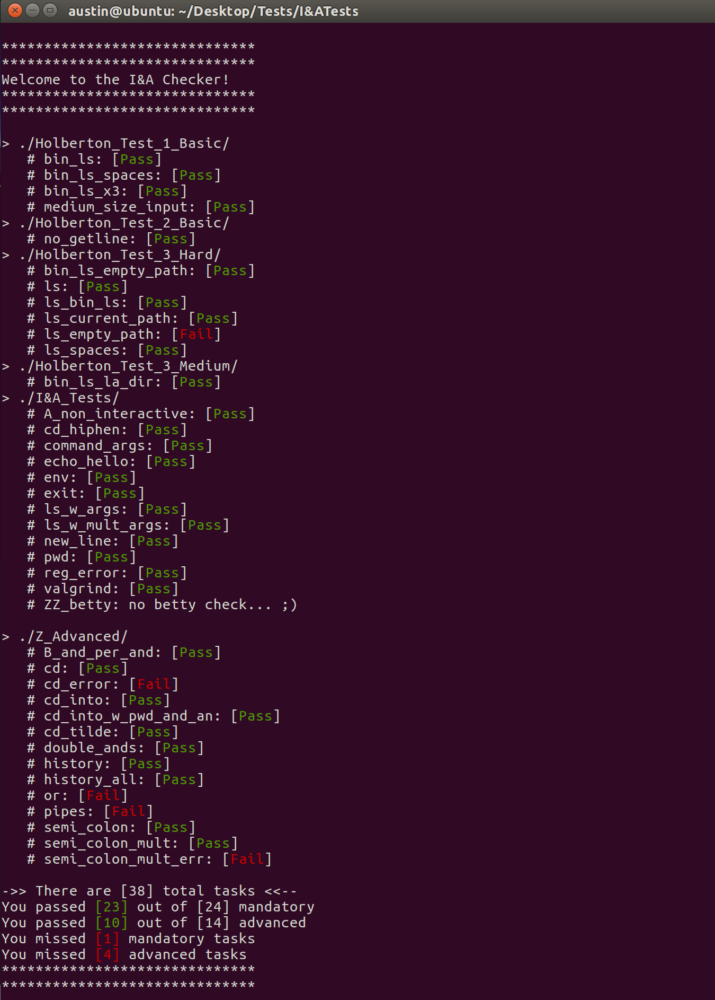

# Welcome to the I&A Checker ;)
## It works very similar Holberton's shell checker found [here](https://github.com/holbertonschool/0x15.c/).

### To get startd, you'll need to modify some settings in the `config` file: 
Change `SHELL` to the directory where your shell executable is, for example:
`SHELL="../../HolbertonRepos/bash_stuff/simple_shell/V3/h"`

!! Attention !!
Not changing the SHELL variable will restult in false tests.

### Next, consider checking out the `Optional settings` section of the `config` file, there you can choose to enable the following:
* `valgrind_check`: Valgrind checks (set on by default, change to `0` to turn off)
* `betty_check`: Betty checks (set off by default)
	--> if you do betty checks, please alter the `bettycheckerdir` variable to point to your folder containing source code for your shell
* `COUNTADV`: gives the ability turn off advanced checks (on by default)
* `FUNMODE`: is a fun mode which changes the interface of the checker (set off by default)
* `SHOWEGG`: An easteregg (on by default)

### If you need to, you can debug your code by setting `SHOWERRORS`to `1`:
	* Showing errors is off by default (to keep things less cluttered)
* !! Please keep in mind only the checks in `I&ATests` and `Z_Advanced` will display detailed debug information because we didn't write the scripts by Holberton

### To execute the checker, just type `./checker.bash` in your terminal from the directory that contains your clone:
* As a side note, please don't clone this checker into your source directory for your shell, the best place to clone is a seperate folder in your HOME dir or Desktop

## Final result should look something like (for fun mode): 

## or below for the professional mode:

### If you'd like to contribute to the checker, please contact either Austin or Isaiah. If you're a shell pro, create a fork and add your own test directory with as many tests as you'd like, once you're finished, create a pull request and we'll test and approve it. :)

#### For any questions, concerns or improvements, please reach out to either Austin or Isaiah via Slack

Cheers!